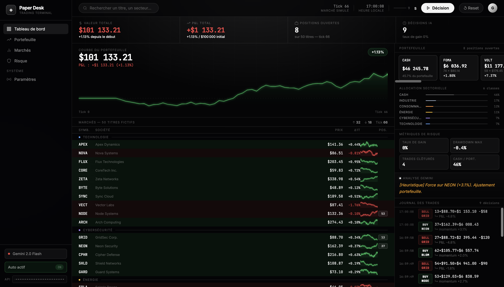

# Paper Desk

> Fictional market paper-trading terminal — Gemini 2.0 Flash AI pilot, 50 tickers, 7 sectors.



## Overview

Paper Desk is a fully client-side, zero-build web trading terminal that simulates a fictional stock market. Fifty tickers across seven sectors tick every 1.1 seconds. An AI pilot (Gemini 2.0 Flash) analyses momentum every 9 seconds and issues up to three buy/sell orders with French-language market commentary. When no API key is present, a heuristic momentum pilot takes over silently — no setup required.

## Features

| Feature | Detail |
|---|---|
| 50 fictional tickers | 7 sectors: Tech, Cybersecurity, Energy, Finance, Health, Consumer, Industry |
| Gemini 2.0 Flash pilot | Up to 3 orders/cycle, French commentary, 15 s fetch timeout |
| Heuristic fallback | Momentum-follow + cut-losers, activates automatically |
| Equity curve | Canvas rendering, gradient fill, live dot, baseline at $100k |
| Portfolio panel | Holdings strip with P&L per position and entry price |
| Sector allocation | Color-coded exposure bars, updates every decision cycle |
| Risk metrics | Win rate, max drawdown, closed trades count, cash ratio |
| Trade journal | Timestamped log with AI reasoning, max 200 entries |
| Auto pilot | 9 s countdown, toggle in sidebar |

## Running

```bash
# No npm. No build. Python 3 only.
python3 -m http.server 8080
```

Open **http://localhost:8080/paperproject/** — ES modules require HTTP; `file://` will not work.

## API Key Setup

**Option A — Sidebar UI** *(simplest)*  
Paste your [Gemini API key](https://aistudio.google.com/app/apikey) into the sidebar field. It persists in `localStorage`.

**Option B — config.json** *(survives page reload without re-entering)*

```bash
cp config.example.json config.json
# edit config.json and fill in your key
```

```json
{ "geminiApiKey": "AIzaSy..." }
```

`config.json` is gitignored and loaded silently at boot. Without any key the heuristic pilot runs automatically — nothing breaks.

## File Structure

```
paperproject/
├── index.html              HTML shell — no logic, no inline styles
├── config.example.json     API key template → copy to config.json
├── .env.example            Environment variable reference
├── .gitignore
├── css/
│   └── style.css           Full design system — glassmorphism, tokens, layout
├── js/
│   ├── config.js           Constants & all 50 ticker definitions
│   ├── state.js            Shared mutable market + portfolio state (ES module singletons)
│   ├── market.js           Random-walk price simulation, equity history
│   ├── trade.js            Order execution, portfolio math (total, doTrade)
│   ├── ai.js               Gemini API call, prompt builder, heuristic fallback
│   ├── render.js           All DOM updates, canvas equity curve, sparklines
│   └── main.js             Boot, auto-pilot loop, decision cycle, event wiring
└── assets/
    └── preview.png         ← add your screenshot here
```
